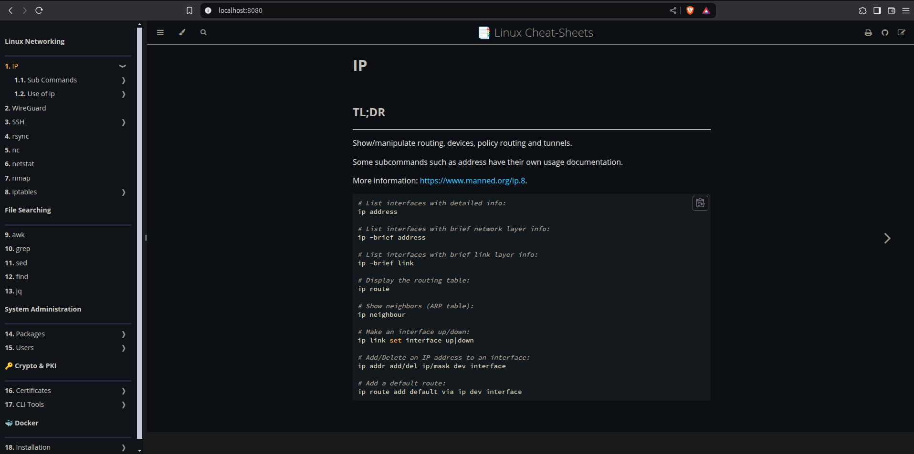

# Installing Dependencies

Before installing rust, we must install GCC.
On Ubuntu/Debian, we will run the following command:


```sh
apt install -y build-essential
```

Install rust:

```sh
curl --proto '=https' --tlsv1.2 -sSf https://sh.rustup.rs | sh
```


Installing the `mdbook` tool:

```sh
cargo install mdbook mdbook-toc
```


# Self-Hosting the web server


```sh
mdbook serve -p 8080
```

In your browser, open this URL: <http://localhost:8080>.

> When the port is not specified, `mdbook` runs by default on port **3000**.


Now you can easily navigate to your desired **Cheat Sheet**, using the **Graphical User Interface** of the website.

