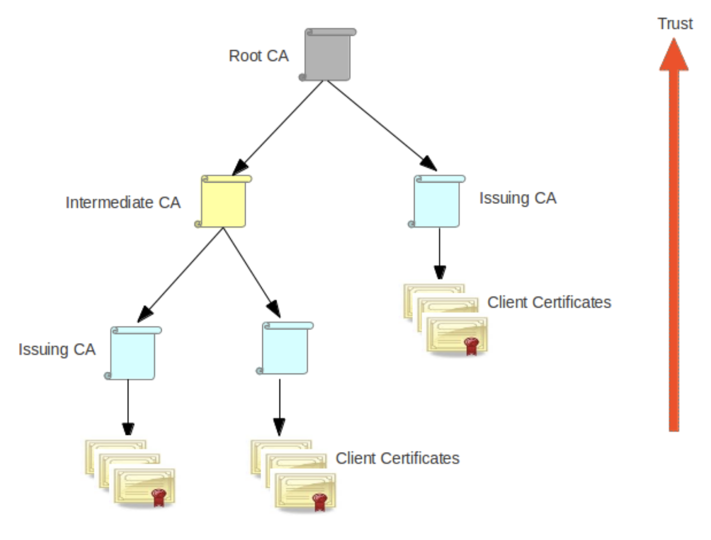
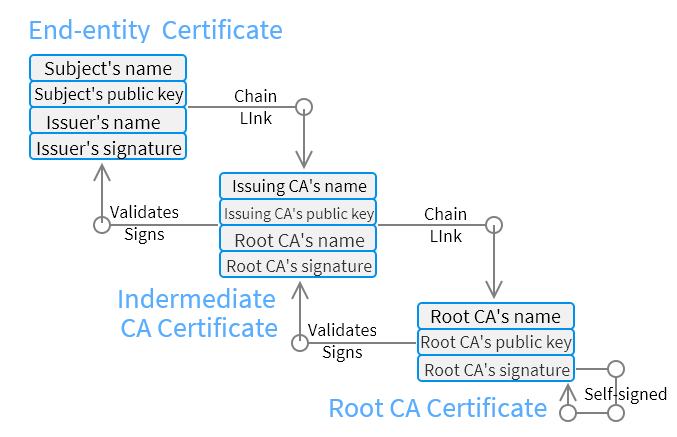

# Certification Authorities (`CA`)

> Read more [here](https://pcom.pages.upb.ro/labs/lab11/crypto/trust.html).

- For two entities to communicate securely using asymmetric encryption, each must know the public key of the other
- The risk that an intruder could replace a public key with their own must be eliminated
- One solution currently used for this problem is key certification by **Certification Authorities** (`CA`)

## Certification process
---
- An entity wishing to obtain a certificate must:
  - Contact a CA, authenticate itself, and provide its public key
  - The Certification Authority decides whether to grant the certificate
  - The certificate
    - Contains the identity and **public key** of the requester
    - Is **digitally signed** by the Certification Authority
  - The format commonly used is `X.509`.

## Certification Authority organization
---
- Certification Authorities are **organized hierarchically**:
  - There are well-known "root" CAs
  - Other CAs are certified by root CAs
  - When verifying an entity's certificate, the CA that issued it is checked, and it will have a certificate from another CA
  - > Verification continues hierarchically until a **trusted CA** or a **root CA** is reached
  - This forms a *"chain of trust"* or a *"certificate path"*
  - Root CAs have self-signed certificates

## Information about the chain of trust
---
- Information about the chain of trust is included in applications
  (email clients, web browsers, etc.) or in the operating system, which serves the interested applications
