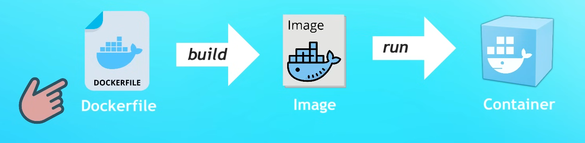

# Tutorial Roadmap


## Containerize your application
---
1. Write `Dockerfile`
2. Build **docker image**
3. Run as **docker container**




## Example of using Docker for a nodeJS app
---

> Dockerfile -> Image -> Container


```sh
❯ tree               
.
├── Dockerfile
├── package.json
└── src
    └── server.js
```

**Dockerfile**:
```Dockerfile
FROM node:19-alpine

COPY package.json /app/
COPY src /app/

WKRKDIR /app

RUN nmap install

CMD ["node", "server.js"]
```

Creating the **Image** (from **Dockerfile**):
```sh
docker build -t node-app:1.0 .
```


Running the **Container** (from **Image**):
```sh
docker run -d -p 3000:3000 node-app:1.0
```


