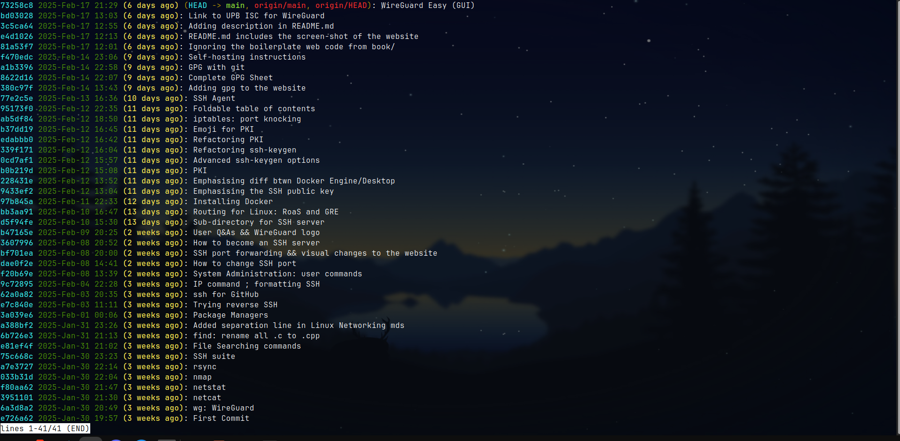

# `git log`

## Basic output
---

```sh
git log
```


## Simplified output
---

```sh
git log --oneline
```


## Prittier output
---

```sh
git log --pretty=format:"%C(green)%h%C(reset) %C(blue)%ad%C(reset) -- %s" --date=format:'%Y-%m-%d %H:%M'
```

<br>
<br>


```sh
git log --pretty=format:"%C(bold cyan)%h%C(reset) %C(green)%ad%C(reset) %C(bold yellow)(%ar)%C(reset)%C(auto)%d%C(reset): %s" --date=format:'%Y-%b-%d %H:%M'
```




## Git Log Colors
---

Colors:
- `black`
- `red`
- `green`
- `yellow`
- `blue`
- `magenta`
- `cyan`
- `white`


Background Colors (for use with the `bg-` prefix):
- `bg-black`
- `bg-red`
- `bg-green`
- `bg-yellow`
- `bg-blue`
- `bg-magenta`
- `bg-cyan`
- `bg-white`

Special Colors (for highlighting or specific emphasis):
- `reset` - Resets the color to the default terminal color
- `bold` - Makes the text bold
- `dim` - Makes the text dim or faded
- `underline` - Underlines the text
- `blink` - Makes the text blink (although not widely supported)
- `reverse` - Inverts the foreground and background colors
- `hidden` - Makes the text invisible (not widely supported)


## Git Log Formatting Placeholders
---

Git's `--pretty=format:` option supports a wide range of special placeholders that start with `%`.
These placeholders represent various attributes of commits, branches, or tags.
Here's a categorized list of the most commonly used placeholders.


### Git Log Formatting | Commit Information
---

| Placeholder | Meaning                              |
|-------------|--------------------------------------|
| `%H`        | Full commit hash                    |
| `%h`        | Abbreviated commit hash (short hash) |
| `%T`        | Full tree hash                      |
| `%t`        | Abbreviated tree hash               |
| `%P`        | Full parent hashes                  |
| `%p`        | Abbreviated parent hashes           |
| `%D`        | Refs (tags, branches)               |


### Git Log Formatting | Author and Committer Information
---

| Placeholder | Meaning                              |
|-------------|--------------------------------------|
| `%an`       | Author name                         |
| `%ae`       | Author email                        |
| `%ad`       | Author date (format customizable)   |
| `%ar`       | Author date, relative               |
| `%at`       | Author date, UNIX timestamp         |
| `%cn`       | Committer name                      |
| `%ce`       | Committer email                     |
| `%cd`       | Committer date (format customizable)|
| `%cr`       | Committer date, relative            |
| `%ct`       | Committer date, UNIX timestamp      |


### Git Log Formatting | Commit Message
---


| Placeholder | Meaning                              |
|-------------|--------------------------------------|
| `%s`        | Subject (first line of the message)  |
| `%b`        | Body (remaining part of the message) |
| `%B`        | Full commit message (subject + body) |


### Git Log Formatting | Refs (Tags, Branches, etc.)
---


| Placeholder | Meaning                              |
|-------------|--------------------------------------|
| `%d`        | Refs (tags or branches, decorated)   |
| `%gD`       | Reflog selector, decorated           |
| `%gs`       | Reflog subject                      |


### Git Log Formatting | Other Useful Placeholders
---


| Placeholder | Meaning                              |
|-------------|--------------------------------------|
| `%N`        | Commit notes                        |
| `%GG`       | Raw verification message from GPG   |
| `%GP`       | GPG signature fingerprint           |
