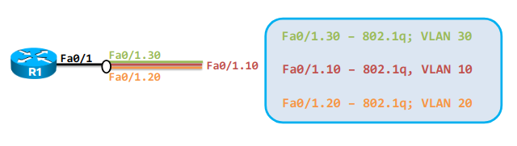
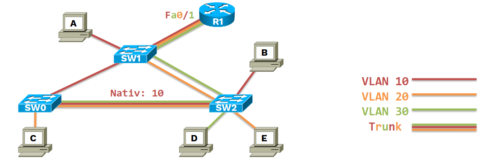

# **RoaS** (Router on a Stick)






The link between a **switch** and a  **router** can be configured as it follows:
- **Switch**: the interface will be **trunk**
- **Router**: the physical interfaces will be split into multiple **logical sub-interfaces**, one for each VLAN

**RoaS** allows inter-VLAN routing.
The router configured as **RoaS** will be able to modify the VLAN tag in the packet and
will be able to FORWARD packets from one VLAN to another (in the same LAN).

Steps:
1. Create VLAN sub-interfaces
2. Assign IP addresses
3. Bring interfaces UP

Example of **RoaS** configuration on Linux:

```sh
# Split (fa01) interface in 3 (logical) sub-interfaces for VLAN 10, VLAN 20 and VLAN 30
$ up ip link add link fa01 name fa01.10 type vlan id 10
$ up ip link add link fa01 name fa01.20 type vlan id 20
$ up ip link add link fa01 name fa01.30 type vlan id 30


# Assign IPv4 addresses on sub-interfaces
$ up ip addr add 10.179.7.1/26 dev fa01.10
$ up ip addr add 10.179.7.65/26 dev fa01.20
$ up ip addr add 10.179.7.129/26 dev fa01.30

# Bring interfaces UP
$ up ip link set fa01.10 up
$ up ip link set fa01.20 up
$ up ip link set fa01.30 up
```

