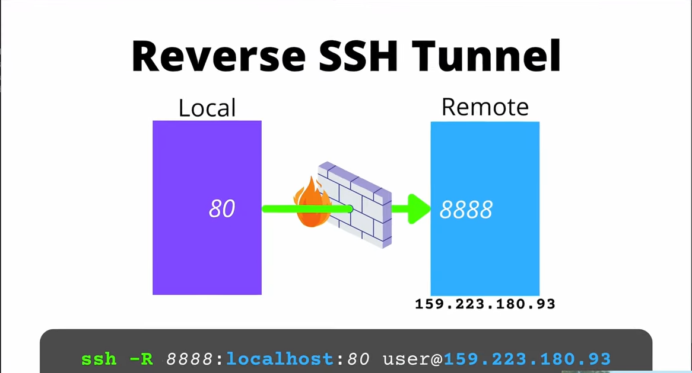

# Remote Port Forwarding

> a.k.a **Reverse SSH**/**Reverse Port Forwarding**.


> Seach for **`-R` flag** in the SSH manual page.

- **-R [bind_address:]port:host:hostport**
- **-R [bind_address:]port:local_socket**
- **-R remote_socket:host:hostport**
- **-R remote_socket:local_socket**
- **-R [bind_address:]port**

## What is a Reverse Tunnel
---

TODO: corecteaza si verifica sa vezi sa fie bine


> **TL;DR**:
> - we act as a **server** instead of a client
> - we no longer connect, we **serve**


| /                       | Normal SSH | Reverse SSH |
| :---:                   | :---:      | :---:       |
| Who runs the `ssh` cmd? | Client     | Server      |

When we run the following command, we become an **SSH client** to a specific station (server):

```sh
ssh user@IP
```


However, things can happen the opposite (**reversed**) way: we can also act as a **server** to a specific client, and the command will look like this:


```sh
ssh -N -R localhost:<port-on-server>:<IP-client>:<port-on-client> <client-user>@<IP-client>
```

Short hand version:


```sh
ssh -N -R <port-on-server>:<IP-client>:<port-on-client> <client-user>@<IP-client>
```


> The command basically maps a port (**port forwarding**) on the (locally run) server to a port of the (remote) client.


## How to Reverse SSH Tunnel
---


<iframe width="750px" height="425px" src="https://www.youtube.com/embed/TZ6W9Hi9YJw" title="How to Reverse SSH Tunnel" frameborder="0" allow="accelerometer; autoplay; clipboard-write; encrypted-media; gyroscope; picture-in-picture; web-share" referrerpolicy="strict-origin-when-cross-origin" allowfullscreen></iframe>


```sh
ssh -N -R localhost:8888:192.168.1.6:80 root@159.223.180.93
```

The local port on 8888 will be accessible on the remote machine


```sh
ssh -N -R 8888:192.168.1.6:80 root@159.223.180.93
```


