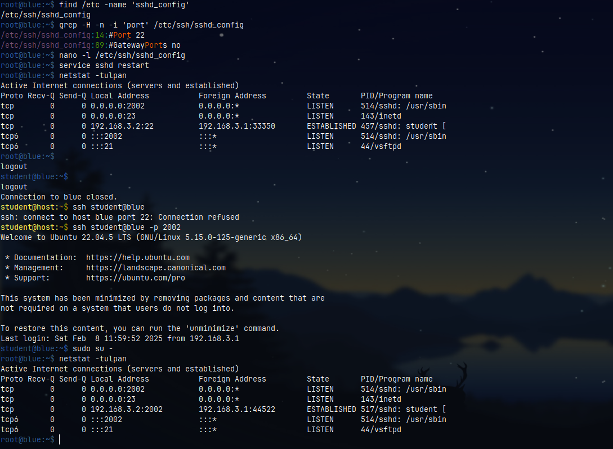

# How to change the port SSH runs on

> By default, SSH runs on **port 22**, but we can change that.

## Commands
---


```sh
$ sudo find /etc/ -name 'sshd_config'
/etc/ssh/sshd_config
```


Open that file and find the line `#Port 22`.
Then uncomment it and replace **22** with a new port number.

```sh
nano -l /etc/ssh/sshd_config    # or vim
```

> Line `#Port 22` -> `Port <number>`


Now, restart the **ssh** process:

For Debian/Ubuntu:

```sh
service sshd restart    
```

You can verify that SSH runs on a different port by typing this **netstat** commadn:

```sh
netstat -tulpan
```


Notice that the **port 22** is no longer opened and default SSH connections are blocked (*refused*).


In order to **SSH** into the remote station, we need to specify the **selected port**:

```sh
ssh <user>@<IP/hostname> -p <port>
```


> Make sure that no firewall rules are applied against the **selected port** for `SSH`-ing into the remote station.


## Also see
---

<iframe width="750" height="425" src="https://www.youtube.com/embed/NRH7mOVhHok" title="How to change the SSH port on Linux or Unix servers | VPS Tutorial" frameborder="0" allow="accelerometer; autoplay; clipboard-write; encrypted-media; gyroscope; picture-in-picture; web-share" referrerpolicy="strict-origin-when-cross-origin" allowfullscreen></iframe>





